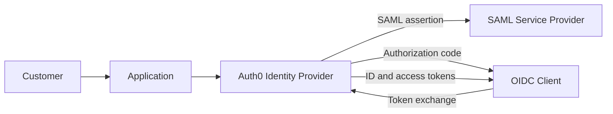

# Auth0 CIAM and SSO Protocol Lab

## Overview

This hands-on Customer Identity and Access Management (CIAM) lab demonstrates how Auth0 functions as an identity provider for SAML 2.0 and OpenID Connect authentication flows.

I configured and tested a SAML web application, inspected XML assertions and identity attributes, completed an OIDC Authorization Code flow, and decoded a JSON Web Token (JWT) to analyze its header, payload, and claims.

> This repository contains sanitized lab documentation only. Client secrets, authorization codes, access tokens, session data, and personally identifiable information are not included.

## Project Objectives

- Configure an Auth0 tenant as an identity provider
- Test SAML 2.0 authentication with a service provider
- Inspect SAML assertions and mapped identity attributes
- Execute an OIDC Authorization Code flow
- Examine OAuth 2.0 authorization responses and tokens
- Decode a JWT and identify standard claims
- Compare SAML and OIDC protocol behavior

## Technologies

- Auth0
- SAML 2.0
- OpenID Connect
- OAuth 2.0 Authorization Code flow
- JSON Web Tokens
- SAML-tracer
- SAML testing service provider
- OIDC Debugger
- JWT.io

## Architecture

## SAML 2.0 Testing

I configured a SAML application in Auth0 and used a SAML testing service provider to initiate authentication. After successful sign-in, I inspected the resulting assertion and reviewed identity attributes supplied by Auth0.

### Validation

- Authentication was redirected to Auth0.
- Auth0 returned a SAML response to the service provider.
- The assertion contained mapped user attributes.
- The service provider accepted the response and created an authenticated session.

### What I Learned

SAML uses XML-based assertions to communicate authentication and attribute information between an identity provider and a service provider. The browser carries the signed response to the service provider, which validates it before granting access.

## OIDC Authorization Code Flow

I configured an OIDC application and used an OIDC debugger to initiate an Authorization Code flow. After authentication, Auth0 returned an authorization code that the client exchanged for tokens.

### Validation

- The authorization request included a redirect URI, client identifier, scope, state, and response type.
- Auth0 authenticated the user and returned an authorization code.
- The client received token data after the code exchange.
- The returned state value supported request/response correlation.

## JWT Inspection

I decoded a lab JWT and reviewed its three components:

1. Header — identified the token type and signing algorithm.
2. Payload — reviewed identity and token-lifetime claims.
3. Signature — understood how a relying party verifies token integrity.

Common claims reviewed included:

- `sub` — unique subject identifier
- `iat` — issued-at time
- `exp` — expiration time
- `iss` — token issuer
- `aud` — intended audience

Decoding a JWT does not validate it. A production application must verify the signature, issuer, audience, expiration, and other relevant claims before trusting the token.

## SAML and OIDC Comparison

| Area | SAML 2.0 | OpenID Connect |
| --- | --- | --- |
| Primary format | XML assertion | JSON/JWT |
| Common use | Enterprise browser SSO | Modern web, mobile, and API authentication |
| Identity parties | Identity Provider and Service Provider | OpenID Provider and Relying Party |
| Built on | SAML standard | OAuth 2.0 |
| Identity artifact | SAML assertion | ID token |

## Security Considerations

- Never expose client secrets, authorization codes, access tokens, refresh tokens, or session cookies.
- Use exact redirect URI allowlists.
- Validate token signatures and claims.
- Use the `state` parameter to reduce request-forgery risk.
- Use PKCE for public clients and modern Authorization Code flows.
- Enforce HTTPS in production.
- Avoid placing live tokens into public decoding tools.
- Apply least privilege when defining scopes and claims.

## Evidence

The sanitized evidence for this project will demonstrate:

1. Successful SAML authentication and mapped user attributes
2. Successful OIDC Authorization Code flow
3. Decoded JWT structure and example claims

## Skills Demonstrated

CIAM, Auth0, SSO, SAML 2.0, OIDC, OAuth 2.0, JWT analysis, claims mapping, authentication troubleshooting, protocol validation, and secure technical documentation.

## Lab Evidence

### SAML 2.0 Authentication

The SAML testing tool displays identity attributes returned by Auth0 after successful authentication. Sensitive values have been redacted.

### OpenID Connect Authorization Code Flow

The OIDC Debugger confirms successful completion of the Authorization Code flow. The state, authorization code, and access token have been redacted.
### JWT Structure and Claims Analysis

I used JWT.io to examine the structure of a JSON Web Token, including its encoded header, payload, algorithm, and identity claims. This screenshot uses sample data and does not contain a production token or secret.

